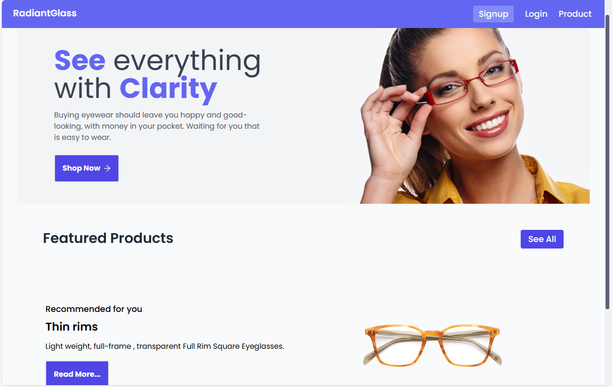

# RadiantGlass

## An E-commerce Store For Glasses

#### - by Yeabtsega Behailu

## Demo
[RadiantGlass](https://RadiatGlass.netlify.app/)


## Images




## Features

-   User Authorization
    -   Sign In
    -   Sign Up
    -   Sign Out
-   Protected/Private Routes
-   Products Listing
-   Various Filters
-   Cart Management
-   Placing an Order
-   Razorpay support
-   User Account Page
-   Managing all Orders
-   Support Page (Under Contruction)

## Tech Stack

**Client:** React, React Router, Context, Tailwind

**Server:** Nodejs Express MongoDB Cloudinary SwaggerUI , RazorPay


## Run On Local Machine

Clone the project

```bash
git clone https://github.com/Yeabtsega1/RdiantGlass.git
```

Go to the project directory

```bash
  cd RdiantGlass
```

Install dependencies

```bash
  npm install
```

Start the server

```bash
  npm run start
```

<br>

#### 👨‍💻 lets connect !

<br>

<a href="https://www.twitter.com/YeabtsegaB1"></a>
<a href="https://www.linkedin.com/in/yeabtsega/"></a>
